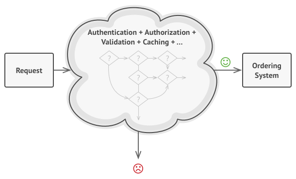
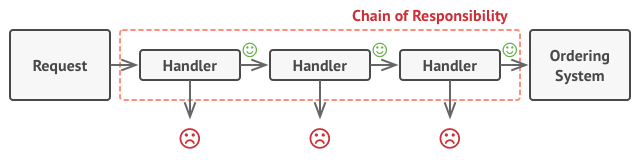

# Behavioral Design Patterns

See more at https://refactoring.guru/design-patterns/behavioral-patterns

## 1. Chain of Responsibility

[See more](https://refactoring.guru/design-patterns/chain-of-responsibility)

#### Problem

#### Solution

